# Benchmarks

## Aggregate building
### agg_dimer_small
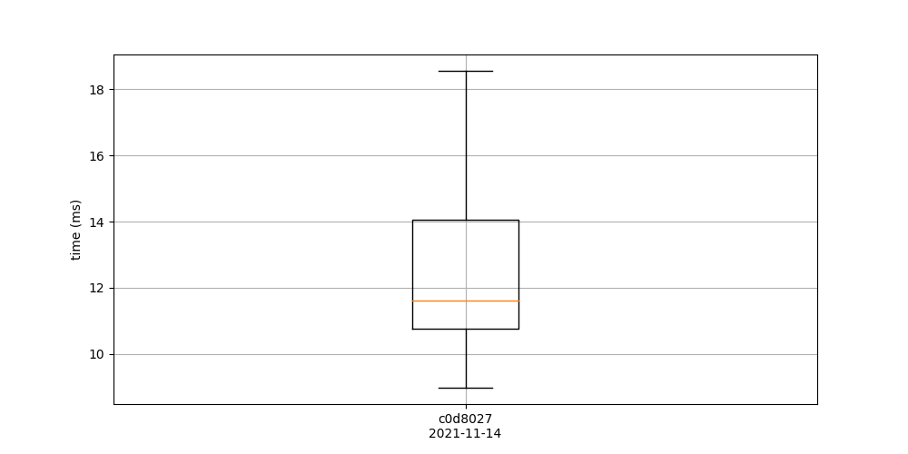
### agg_dimer_medium
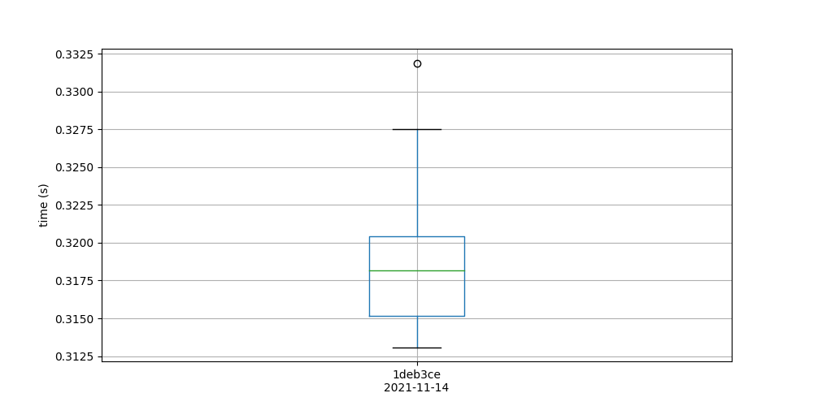
### agg_dimer_big
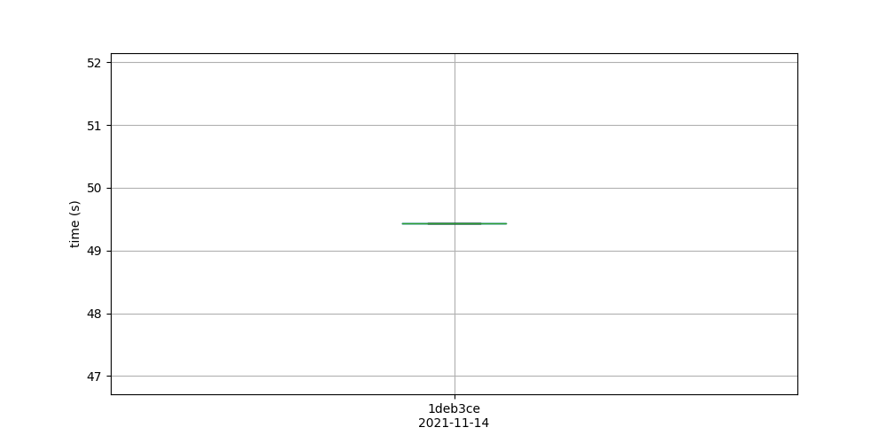
### agg_building
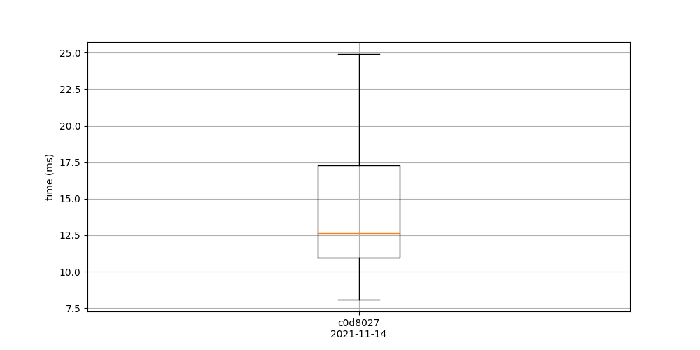
### getFranckCondonFactors
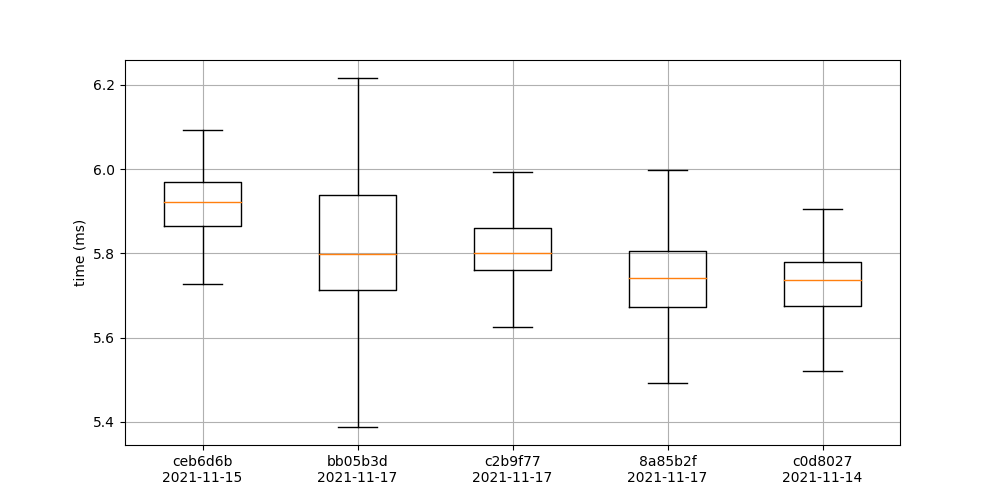
### getFCProd
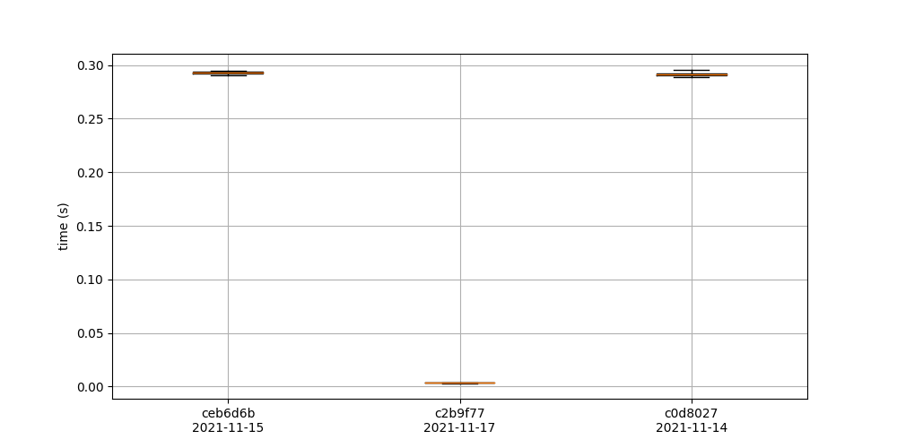
### getAggHamiltonian
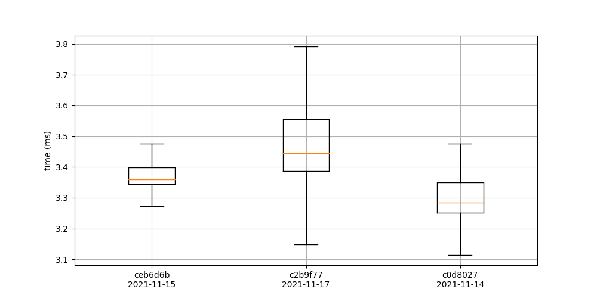
### getAggHamiltonianInteraction
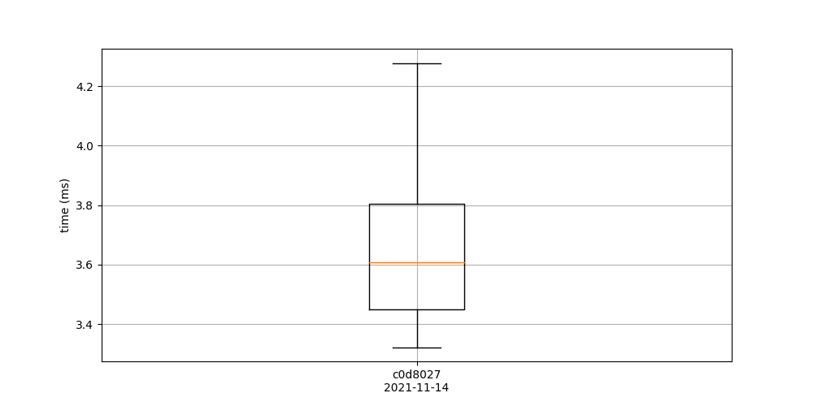

## Simulation
### trace_bath
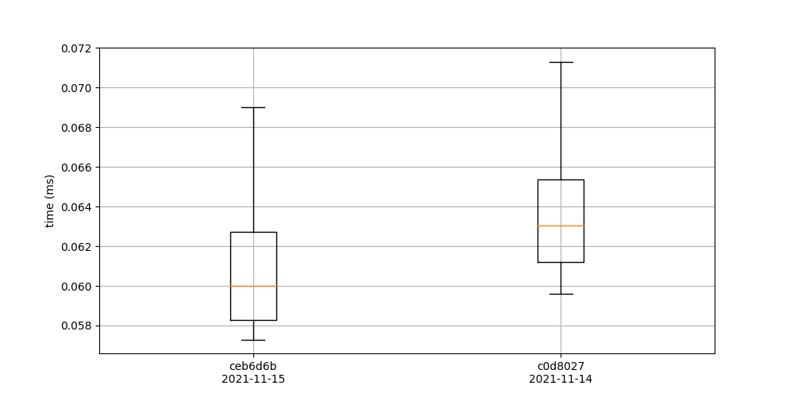
## evolutionExact
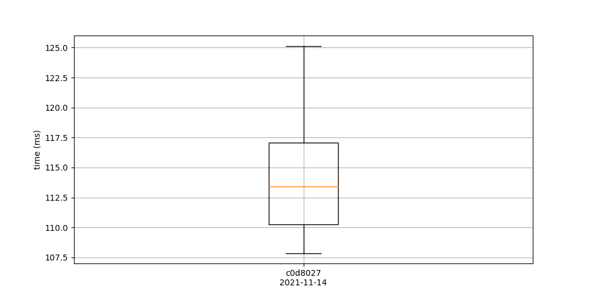
## evolutionApproximate

## schroedinger
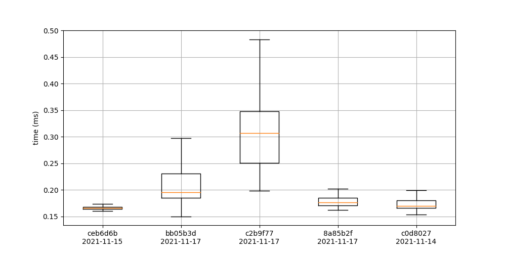
## liouvilleVonNeumann
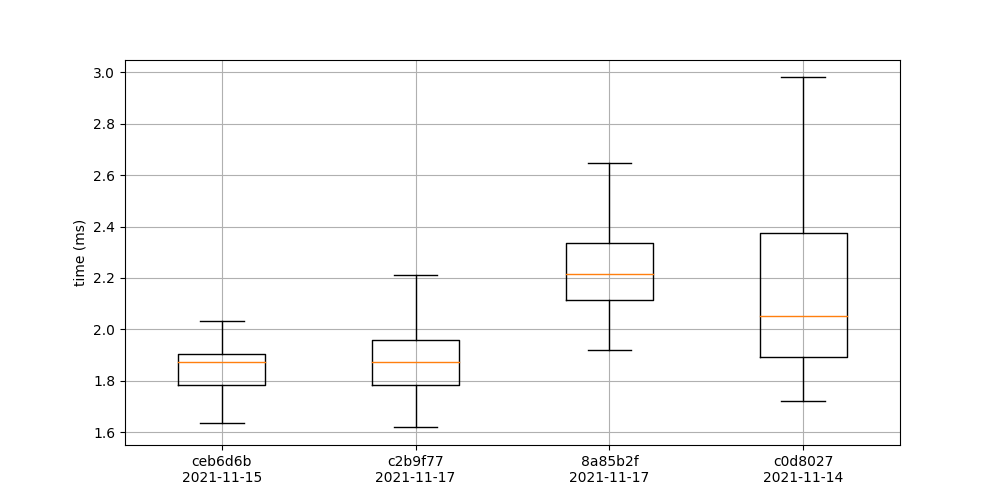
## evolutionOperatorIterator
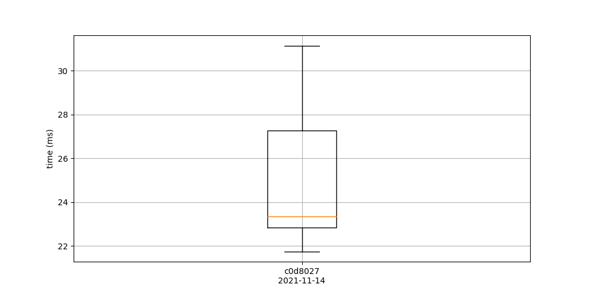
## master_int
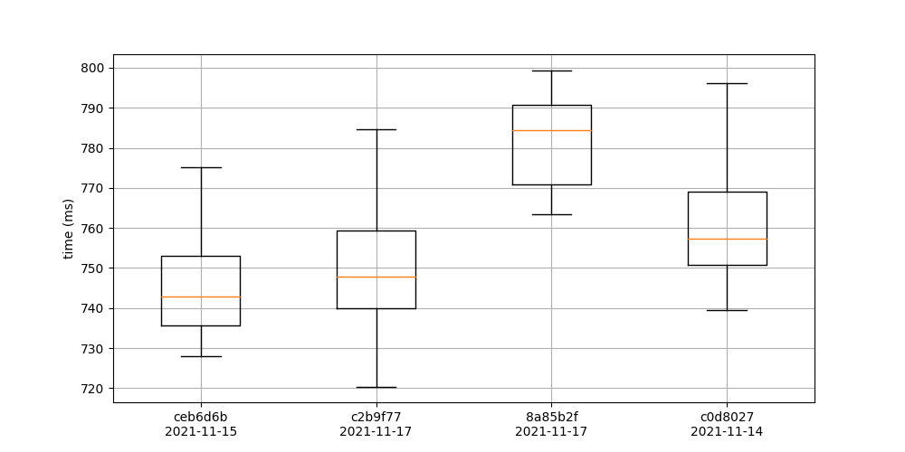
## master_ansatz
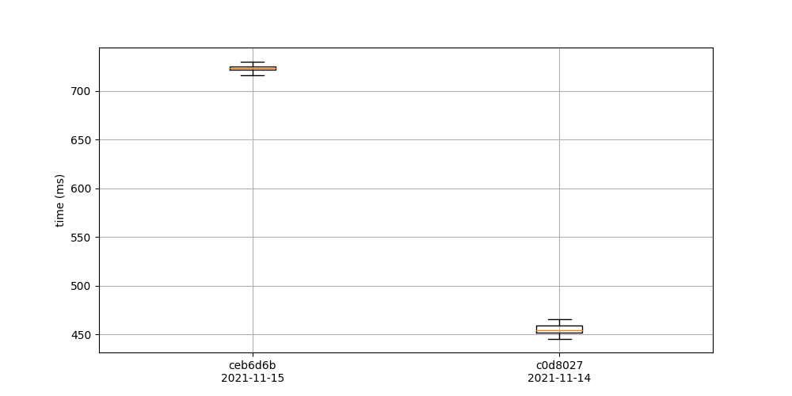