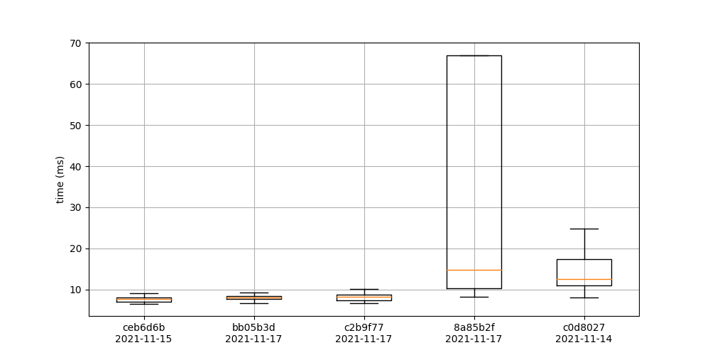
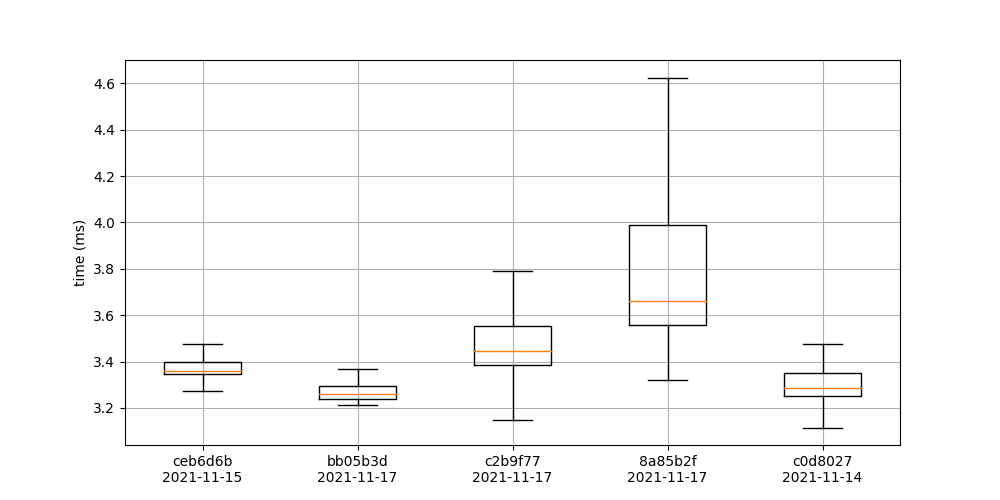
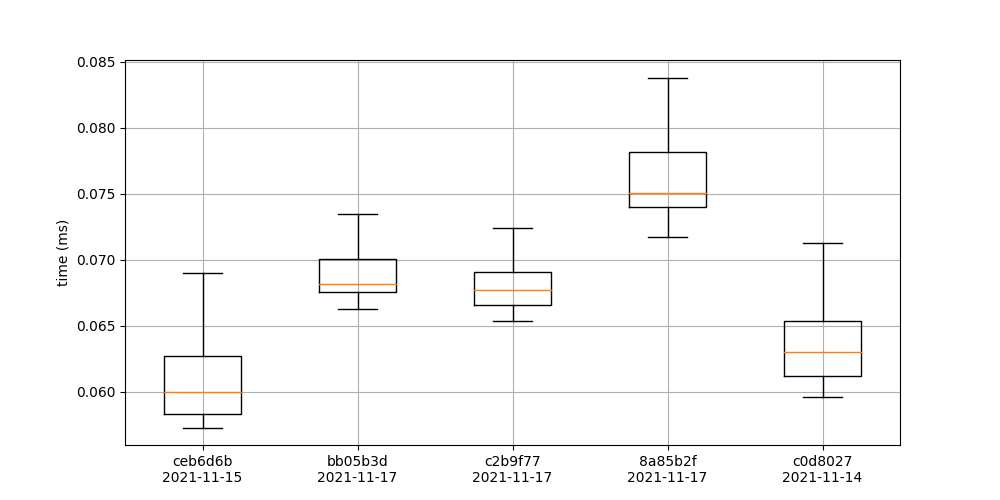
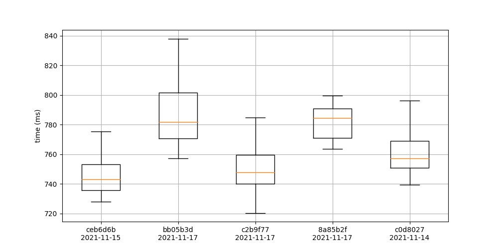

# Benchmarks

## Aggregate building

### agg_dimer_small

### agg_dimer_medium

### agg_building

### getFranckCondonFactors

### getFCProd

### getAggHamiltonian

### getAggHamiltonianInteraction

## Simulation

### trace_bath

## evolutionExact

## evolutionApproximate

## schroedinger

## liouvilleVonNeumann

## evolutionOperatorIterator

## master_int

## master_ansatz

