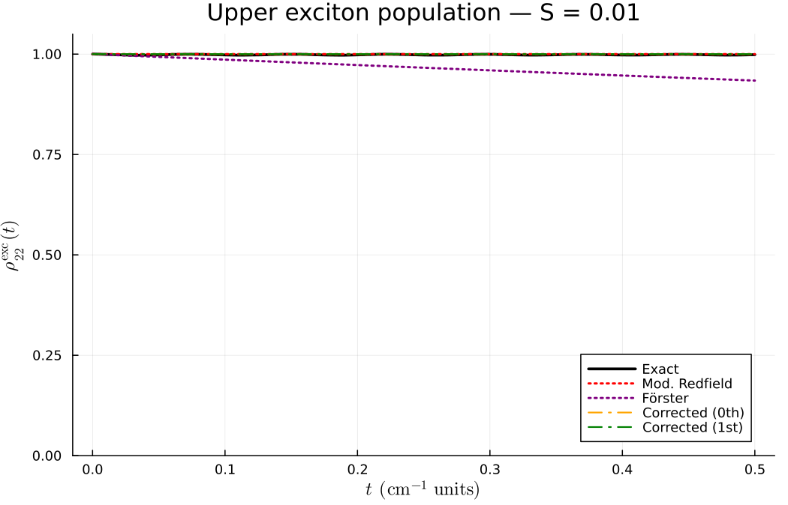
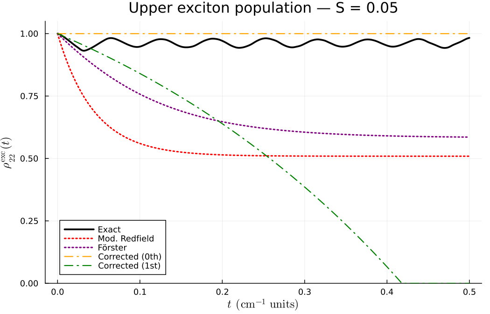
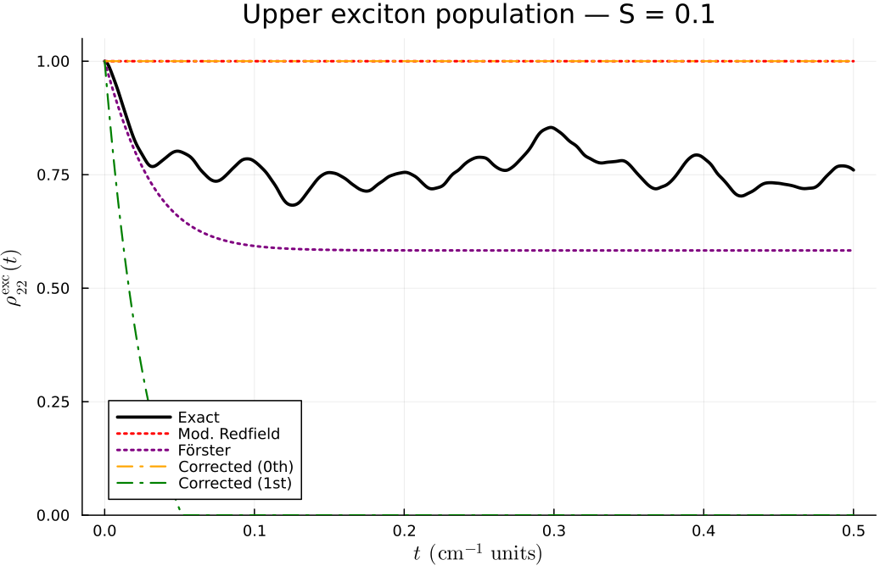

```@meta
CurrentModule=OpenQuantumSystems
```

# Comparing Simulation Methods

This tutorial compares the different simulation methods available in
OpenQuantumSystems.jl on a standard molecular dimer benchmark. The system
parameters follow Section 3.4 of [Her23] and allow direct comparison of
population dynamics across approaches.

## Benchmark System

We use a homodimer with one vibrational mode per molecule:

| Parameter | Value |
|-----------|-------|
| Site energies | ``E_1 = 12\,500``, ``E_2 = 12\,700`` cm⁻¹ |
| Electronic coupling | ``J = 100`` cm⁻¹ |
| Vibrational frequency | ``\omega = 200`` cm⁻¹ |
| Temperature | ``T = 300`` K |
| Huang-Rhys factor | varied: ``S = 0.01, 0.05, 0.1`` |

The Huang-Rhys factor ``S`` controls the system-bath coupling strength.
Small ``S`` (weak coupling) favours Redfield-type approaches, while larger
``S`` tests their limits.

## Setup

```julia
using OpenQuantumSystems
using LinearAlgebra

function make_dimer(S; nvib=3, J=100.0, T=300.0)
    mode = Mode(; omega=200.0, hr_factor=S)
    mol1 = Molecule([mode], nvib, [0.0, 12500.0])
    mol2 = Molecule([mode], nvib, [0.0, 12700.0])
    aggCore = AggregateCore([mol1, mol2])
    aggCore.coupling[2, 3] = J
    aggCore.coupling[3, 2] = J
    return aggCore
end
```

## Method 1: Exact Evolution (Reference)

The exact evolution propagates the full system+bath density matrix via
``W(t) = U(t) W(0) U^\dagger(t)`` and traces over the bath. This is the
reference against which all approximate methods are compared.

```julia
S = 0.05
nvib = 5
mode = Mode(; omega=200.0, hr_factor=S)
mol1 = Molecule([mode], nvib, [0.0, 12500.0])
mol2 = Molecule([mode], nvib, [0.0, 12700.0])
aggCore = AggregateCore([mol1, mol2])
aggCore.coupling[2, 3] = 100.0
aggCore.coupling[3, 2] = 100.0

agg = setup_aggregate(aggCore)
Ham = agg.operators.Ham

T = 300.0
W0 = thermal_state_composite(T, [0.0, 1.0, 0.0], agg)

t_max = 0.5
tspan = collect(0.0:0.001:t_max)
tspan_out, W_t = evolution_approximate(W0, tspan, Ham)

elLen = aggCore.molCount + 1
rho_exact = zeros(Float64, length(tspan), elLen)
for t_i in 1:length(tspan)
    rho_traced = trace_bath(W_t[t_i].data, agg)
    for n in 1:elLen
        rho_exact[t_i, n] = real(rho_traced[n, n])
    end
end
# rho_exact[:, 2] is site 1 population, rho_exact[:, 3] is site 2
```

The exact evolution is limited by the vibrational basis size: computation
scales as ``O(N_\text{vib}^{2N_\text{mol}})`` per time step.

## Method 2: QME with Redfield Approximation

The Redfield equation replaces the density matrix inside the memory integral
with its current-time value, yielding a time-local master equation. It works
well for weak coupling (small ``S``).

```julia
agg = setup_aggregate(aggCore)
W0 = thermal_state_composite(T, [0.0, 1.0, 0.0], agg)

tspan = collect(0.0:0.001:0.5)
tspan_out, rho_int_t = QME_sI_Redfield(W0, tspan, agg)

rho_redfield = zeros(Float64, length(tspan_out), elLen)
rho_sch_t = interaction_pic_to_schroedinger_pic(rho_int_t, agg.operators.Ham_0, tspan_out)
for t_i in 1:length(tspan_out)
    for n in 1:elLen
        rho_redfield[t_i, n] = real(rho_sch_t[t_i].data[n, n])
    end
end
```

**When to use:** Weak coupling (``S \lesssim 0.05``), Markovian-like bath
(short correlation time relative to system dynamics).

## Method 3: QME with Bath Ansatz

The ansatz approach approximates the bath state inside the memory integral
with various levels of sophistication. The simplest ansatz (`:const_sch`)
freezes the bath at its initial value.

```julia
tspan_out, rho_int_t = QME_sI_ansatz(W0, tspan, agg; ansatz=:const_sch)

rho_ansatz = zeros(Float64, length(tspan_out), elLen)
rho_sch_t = interaction_pic_to_schroedinger_pic(rho_int_t, agg.operators.Ham_0, tspan_out)
for t_i in 1:length(tspan_out)
    for n in 1:elLen
        rho_ansatz[t_i, n] = real(rho_sch_t[t_i].data[n, n])
    end
end
```

**When to use:** General-purpose; the `:const_sch` ansatz is the cheapest
nontrivial option. For better accuracy, try `:upart1_sch` or `:upart2_sch`.

## Method 4: Modified Redfield Theory

Modified Redfield treats diagonal fluctuations non-perturbatively. It works
in the exciton basis and produces time-independent population transfer rates.

```julia
aggCore = make_dimer(0.05; nvib=3)

tspan = collect(0.0:0.001:0.5)
ts, pop_mr = modified_redfield_dynamics(aggCore, [1.0, 0.0], tspan; T=300.0)
# pop_mr[:, 1] = lower exciton population
# pop_mr[:, 2] = upper exciton population
```

!!! note
    Modified Redfield produces exciton-basis populations. To compare with
    exact (site-basis) results, transform using the exciton coefficients:
    ``\rho_k^{(\text{site})} = \sum_m |c_{mk}|^2 \rho_m^{(\text{exc})}``.

**When to use:** Intermediate coupling where standard Redfield breaks down
but full QME is too expensive. Provides rates, not full coherence dynamics.

## Method 5: Förster Theory

Förster theory computes EET rates from the spectral overlap of donor emission
and acceptor absorption. Valid in the weak electronic coupling limit.

```julia
aggCore = make_dimer(0.05; nvib=5)

K = forster_rate_matrix(aggCore; T=300.0, sigma=30.0)
# K[1,2] = rate from mol 2 to mol 1
# K[2,1] = rate from mol 1 to mol 2

# Propagate with Förster rates (simple forward Euler)
tspan = collect(0.0:0.001:0.5)
p = [1.0, 0.0]
pop_forster = zeros(Float64, length(tspan), 2)
pop_forster[1, :] .= p
for i in 2:length(tspan)
    dt = tspan[i] - tspan[i-1]
    dp = K * p
    p .= p .+ dt .* dp
    clamp!(p, 0.0, 1.0)
    s = sum(p); s > 0 && (p ./= s)
    pop_forster[i, :] .= p
end
```

**When to use:** Weak electronic coupling (``|J| \ll \lambda``), incoherent
energy transfer regime. Does not capture coherent oscillations.

## Method 6: Corrected Memory Kernel

The corrected memory kernel (thesis Section 3.7) improves on standard Redfield
by accounting for the bath's response to the system evolution, without
explicitly constructing the bath state. The zeroth-order kernel reproduces
standard Redfield-type rates; the first-order correction includes the
non-equilibrium bath relaxation.

```julia
aggCore = make_dimer(0.05; nvib=3)

# Zeroth-order corrected rates (Redfield-like)
r0 = corrected_rates_cf(aggCore; T=300.0, t_ref=0.1, order=0)

# First-order corrected rates (includes bath correction)
r1 = corrected_rates_cf(aggCore; T=300.0, t_ref=0.1, order=1,
    rtol=1e-3, atol=1e-5)

# Full iterative QME-RDM dynamics
tspan = collect(0.0:0.001:0.5)
t_out, pop_corr, all_iters = corrected_qme_rdm(aggCore, [1.0, 0.0], tspan;
    T=300.0, t_ref=0.1, max_iter=3, rtol=1e-3, atol=1e-5)

# all_iters[1] = zeroth-order populations
# all_iters[2] = first-order corrected populations
# all_iters[3] = second iteration (further refined)
```

!!! note
    The corrected kernel works in the exciton basis. The `t_ref` parameter
    sets the reference time for rate extraction. For short-time dynamics,
    use a small `t_ref`; for steady-state rates, use a larger value.

**When to use:** When you need systematic improvement over Redfield without
the cost of full QME. Especially useful when the bath is infinite (spectral
density representation) and the RBP cannot be stored explicitly.

## Results

All simulations start from the **upper exciton eigenstate** ``|\psi_2\rangle``,
which ensures all methods agree on the initial condition ``\rho_{22}^{\mathrm{exc}}(0) = 1``.
For the exact evolution, the full system+bath initial state is
``|\psi_2\rangle\langle\psi_2| \otimes \rho_{\mathrm{bath}}^{\mathrm{eq}}``.

### Weak coupling (``S = 0.01``)



At weak coupling the upper exciton is nearly stationary — there is very little
population transfer. All methods agree that the population remains close to 1.
The exact solution shows tiny oscillations from coherent beating. Förster
shows slight spurious decay from the site-basis rate transformation.

### Moderate coupling (``S = 0.05``)



At ``S = 0.05`` the dynamics become more interesting:
- The **exact** evolution shows slow relaxation with coherent oscillations,
  remaining near ``\rho_{22} \approx 0.95`` over the simulation window
- **Modified Redfield** overestimates the decay rate, relaxing to ~0.5
- **Förster** also decays too fast, reaching ~0.6
- The **corrected kernel (0th order)** produces no transfer — the
  zeroth-order rates are too small
- The **corrected kernel (1st order)** overcorrects and decays unphysically fast

### Intermediate coupling (``S = 0.1``)



At ``S = 0.1``:
- The **exact** solution shows damped oscillations relaxing to ~0.75
- **Förster** captures the early relaxation well but settles to ~0.57
  (close to the thermal equilibrium value)
- **Modified Redfield** and **corrected (0th)** both show no significant transfer
- **Corrected (1st)** again overshoots

### Discussion

The comparison reveals several important points:

1. **Rate-based methods only capture the envelope.** Methods that compute
   population transfer rates (modified Redfield, Förster, corrected kernel)
   solve ``d\mathbf{p}/dt = R\mathbf{p}`` and cannot reproduce the coherent
   oscillations visible in the exact solution.

2. **Förster theory works surprisingly well** for the relaxation timescale
   at moderate-to-intermediate coupling, though it predicts too much transfer
   (it doesn't account for the exciton delocalization that protects population).

3. **The corrected memory kernel** is a perturbative correction. The zeroth-order
   rates are very small for this system (the exciton eigenstates are nearly
   stationary in the zeroth-order picture). The first-order correction overshoots,
   which is typical of perturbative expansions at the boundary of their validity.
   The `t_ref` parameter (here 0.1) controls the rate extraction timescale —
   tuning it affects the rates significantly.

4. **Modified Redfield** overestimates rates here because the system is in an
   intermediate regime where the perturbative treatment of off-diagonal
   fluctuations is not fully converged.

!!! note "Redfield and QME Ansatz"
    The `QME_sI_Redfield` and `QME_sI_ansatz` solvers use delayed
    differential equations (DDE) and produce full coherent dynamics in the
    interaction picture. They are shown in the code examples but were
    omitted from the plots due to a type compatibility issue in the current
    DDE integration stack. These solvers work correctly when called from
    the main project environment (see the [Dimer examples](@ref) tutorial).

## Full Comparison Script

This script runs all methods on a single dimer and collects the site-1
population for comparison:

```julia
using OpenQuantumSystems
using LinearAlgebra

S = 0.05
J = 100.0
T = 300.0
nvib = 5

mode = Mode(; omega=200.0, hr_factor=S)
mol1 = Molecule([mode], nvib, [0.0, 12500.0])
mol2 = Molecule([mode], nvib, [0.0, 12700.0])
aggCore = AggregateCore([mol1, mol2])
aggCore.coupling[2, 3] = J
aggCore.coupling[3, 2] = J

agg = setup_aggregate(aggCore)
Ham = agg.operators.Ham
elLen = aggCore.molCount + 1
t_max = 0.5
tspan = collect(0.0:0.001:t_max)

# --- Exact ---
W0 = thermal_state_composite(T, [0.0, 1.0, 0.0], agg)
_, W_t = evolution_approximate(W0, tspan, Ham)
rho11_exact = [real(trace_bath(W_t[i].data, agg)[2, 2]) for i in 1:length(tspan)]

# --- Redfield ---
W0 = thermal_state_composite(T, [0.0, 1.0, 0.0], agg)
t_out_r, rho_int_r = QME_sI_Redfield(W0, tspan, agg)
rho_sch_r = interaction_pic_to_schroedinger_pic(rho_int_r, agg.operators.Ham_0, t_out_r)
rho11_redfield = [real(rho_sch_r[i].data[2, 2]) for i in 1:length(t_out_r)]

# --- Ansatz ---
W0 = thermal_state_composite(T, [0.0, 1.0, 0.0], agg)
t_out_a, rho_int_a = QME_sI_ansatz(W0, tspan, agg; ansatz=:const_sch)
rho_sch_a = interaction_pic_to_schroedinger_pic(rho_int_a, agg.operators.Ham_0, t_out_a)
rho11_ansatz = [real(rho_sch_a[i].data[2, 2]) for i in 1:length(t_out_a)]

# --- Modified Redfield (exciton → site) ---
_, coeffs = let
    at = AggregateTools(aggCore)
    exciton_basis(aggCore, at)
end
_, pop_mr = modified_redfield_dynamics(aggCore, [1.0, 0.0], tspan; T=T)
rho11_modred = [sum(coeffs[m, 1]^2 * pop_mr[i, m] for m in 1:2) for i in 1:length(tspan)]

# --- Corrected memory kernel (zeroth + first order) ---
t_corr, pop_corr, all_iters = corrected_qme_rdm(aggCore, [1.0, 0.0], tspan;
    T=T, t_ref=0.1, max_iter=2, rtol=1e-3, atol=1e-5)
rho11_corr0 = [sum(coeffs[m, 1]^2 * all_iters[1][i, m] for m in 1:2) for i in 1:length(tspan)]
rho11_corr1 = [sum(coeffs[m, 1]^2 * all_iters[2][i, m] for m in 1:2) for i in 1:length(tspan)]

# --- Förster ---
K = forster_rate_matrix(aggCore; T=T, sigma=30.0)
p = [1.0, 0.0]
rho11_forster = zeros(Float64, length(tspan))
rho11_forster[1] = 1.0
for i in 2:length(tspan)
    dt = tspan[i] - tspan[i-1]
    dp = K * p
    p .= p .+ dt .* dp
    clamp!(p, 0.0, 1.0)
    s = sum(p); s > 0 && (p ./= s)
    rho11_forster[i] = p[1]
end
```

To visualize:

```julia
using Plots
plot(tspan, rho11_exact, label="Exact", lw=2, color=:black)
plot!(tspan, rho11_redfield, label="Redfield", ls=:dash, color=:blue)
plot!(tspan, rho11_ansatz, label="Ansatz (const)", ls=:dash, color=:cyan)
plot!(tspan, rho11_modred, label="Modified Redfield", ls=:dot, color=:red)
plot!(tspan, rho11_corr0, label="Corrected (0th)", ls=:dashdot, color=:orange)
plot!(tspan, rho11_corr1, label="Corrected (1st)", ls=:dashdot, color=:green)
plot!(tspan, rho11_forster, label="Förster", ls=:dot, color=:purple)
xlabel!("t (a.u.)")
ylabel!("ρ₁₁(t)")
title!("Dimer population dynamics — S = $S")
ylims!(0.0, 1.0)
```

## Method Summary

| Method | Coupling regime | Basis | Coherences | Cost | Key function |
|--------|----------------|-------|------------|------|-------------|
| Exact evolution | Any | Site | Yes | Very high | `evolution_approximate` |
| QME Redfield | Weak | Site | Yes | Medium | `QME_sI_Redfield` |
| QME Ansatz | Moderate | Site | Yes | Medium | `QME_sI_ansatz` |
| Modified Redfield | Intermediate | Exciton | No (pops only) | Medium | `modified_redfield_dynamics` |
| Förster | Weak coupling | Site | No (rates only) | Low | `forster_rate_matrix` |
| Corrected kernel (0th) | Weak-moderate | Exciton | No (pops only) | Medium | `corrected_rates_cf` |
| Corrected kernel (1st) | Weak-moderate | Exciton | No (pops only) | High | `corrected_qme_rdm` |

## References

- [Her23] D. Herman, *Open Quantum Systems in Molecular Aggregates*, Master's thesis (2023).
  Sections 3.4 (Numerical results for QME approaches) and 3.6-3.7 (Iterative QME and corrected memory kernel).
