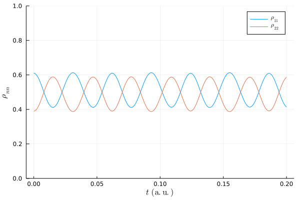
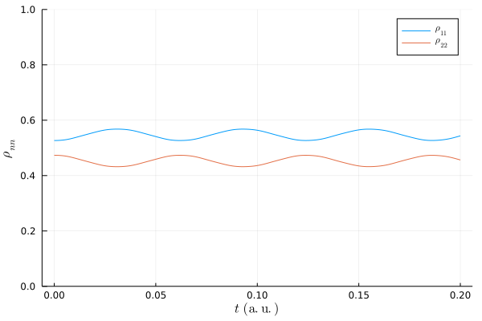

```@meta
CurrentModule=OpenQuantumSystems
```

# Dimer examples

## Simple example
Running the basics dimer with ultra-fast laser excitation.

```julia
using Plots
using LaTeXStrings
using OpenQuantumSystems

HR = 0.01
shift = (2.0 * HR)^0.5
mode = Mode(300., shift)
mols = [
    Molecule([mode], 5, [12500., 12750.]),
    Molecule([mode], 5, [12500., 12800.])
]

agg = Aggregate(mols)
# 1 is for el. ground state
agg.coupling[2, 3] = 100
agg.coupling[3, 2] = 100

aggInds, vibindices, aggIndLen, basis, FCFact, FCProd, Ham, Ham_0, Ham_I = 
    setupAggregate(agg; verbose=false)

T = 100 # temperature
W0 = thermal_state_composite(T, [0.0, 0.5, 0.5], Ham, aggInds) # laser excitation
t_max = 0.2
t_count = 250
tspan=[0.0:t_max/t_count:t_max;]
tspan, W_t = evolution_approximate(W0, tspan, Ham)
rho_tr_t = zeros(ComplexF64, length(tspan), 2, 2)
for t_i in 1:length(tspan)
    rho_tr_t[t_i, :, :] = trace_bath(W_t[t_i].data, agg, FCProd, aggInds, vibindices)
end

plot(tspan, real(rho_tr_t[:, 1, 1]), label=L"\rho_{11}")
plot!(tspan, real(rho_tr_t[:, 2, 2]), label=L"\rho_{22}", 
    ylim=(0.0,1.0), ylabel=L"\rho_{nn}", xlabel=L"t\:\:\mathrm{(a.u.)}")
```


## Local vs exciton basis
Running the basics dimer with ultra-fast laser excitation.

```julia
using ProgressMeter
using Plots
using LaTeXStrings
using OpenQuantumSystems

HR = 0.01
shift = (2.0 * HR)^0.5
mode = Mode(300., shift)
mols = [
    Molecule([mode], 5, [12500., 12750.]),
    Molecule([mode], 5, [12500., 12800.])
]

agg = Aggregate(mols)
# 1 is for el. ground state
agg.coupling[2, 3] = 100
agg.coupling[3, 2] = 100

aggInds, vibindices, aggIndLen, basis, FCFact, FCProd, Ham, Ham_0, Ham_I = 
    setupAggregate(agg; verbose=false)

Ham_sys = getAggHamiltonianSystem(agg; groundState = false)
Ham_sys_lambda, Ham_sys_S = eigen(Ham_sys.data)
Ham_sys_Sinv = inv(Ham_sys_S)
Ham_sys_lambda = diagm(Ham_sys_lambda)

T = 100 # temperature
W0 = thermal_state_composite(T, [0.0, 0.5, 0.5], Ham, aggInds) # laser excitation

t_max = 0.2
t_count = 500
tspan=[0.0:t_max/t_count:t_max;]
```

Calculating dynamics in local basis.
```julia
rho_tr_t = zeros(ComplexF64, length(tspan), 2, 2)
t_i = 0
t_step = tspan[2] - tspan[1]
U_op_step = evolutionOperator(Ham, t_step)
U_op_step_d = U_op_step'
W = deepcopy(W0)
p = Progress(t_count, barglyphs=BarGlyphs("[=> ]"), barlen=50)
for t_i in 1:length(tspan)
    rho_traced = trace_bath(W.data, agg, FCProd, aggInds, vibindices; groundState=false)
    rho_tr_t[t_i, :, :] = rho_traced
    W = U_op_step * W * U_op_step_d
    ProgressMeter.next!(p)
end

plot(tspan, real(rho_tr_t[:, 1, 1]), label=L"\rho_{11}")
plot!(tspan, real(rho_tr_t[:, 2, 2]), label=L"\rho_{22}", 
    ylim=(0.0,1.0), ylabel=L"\rho_{nn}", xlabel=L"t\:\:\mathrm{(a.u.)}")
```



Calculating dynamics in exciton basis.
```julia
rho_tr_t = zeros(ComplexF64, length(tspan), 2, 2)
t_i = 0
t_step = tspan[2] - tspan[1]
U_op_step = evolutionOperator(Ham, t_step)
U_op_step_d = U_op_step'
W = deepcopy(W0)
p = Progress(t_count, barglyphs=BarGlyphs("[=> ]"), barlen=50)
for t_i in 1:length(tspan)
    rho_traced = trace_bath(W.data, agg, FCProd, aggInds, vibindices; groundState=false)
    rho_traced = Ham_sys_Sinv * rho_traced * Ham_sys_S
    rho_tr_t[t_i, :, :] = rho_traced
    W = U_op_step * W * U_op_step_d
    ProgressMeter.next!(p)
end

plot(tspan, real(rho_tr_t[:, 1, 1]), label=L"\rho_{11}")
plot!(tspan, real(rho_tr_t[:, 2, 2]), label=L"\rho_{22}", 
    ylim=(0.0,1.0), ylabel=L"\rho_{nn}", xlabel=L"t\:\:\mathrm{(a.u.)}")
```



## Animating density matrix

Plotting the diagonal of bath part of density matrix.

```julia
W_bath_t = zeros(ComplexF64, length(tspan), aggIndLen, aggIndLen)
t_i = 0
t_step = tspan[2] - tspan[1]
U_op_step = evolutionOperator(Ham, t_step)
U_op_step_d = U_op_step'
W = deepcopy(W0)
p = Progress(t_count, barglyphs=BarGlyphs("[=> ]"), barlen=50)
for t_i in 1:length(tspan)
    W_bath = get_rho_bath(W.data, agg, FCProd, aggInds, vibindices; 
        groundState = false, justCopy=false)
    W_bath_t[t_i, :, :] = W_bath
    W = U_op_step * W * U_op_step_d
    ProgressMeter.next!(p)
end

plot(tspan, real(W_bath_t[:, 1, 1]), label=L"\rho_{\mathrm{B,}11}")
println(aggIndLen)
for i in 2:(length(vibindices[2]) - 1)
    plot!(tspan, real(W_bath_t[:, i, i]), label=L"\rho_{\mathrm{B,}%$i%$i}")
end
i = length(vibindices[2])
plot!(tspan, real(W_bath_t[:, i, i]), 
    label=L"\rho_{\mathrm{B,}%$i%$i}", ylim=(0.0,1.0), ylabel=L"\rho_{nn}", 
    xlabel=L"t\:\:\mathrm{(a.u.)}")
```


```julia
p = Progress(t_count, barglyphs=BarGlyphs("[=> ]"), barlen=50)
anim = @animate for i = 1:length(tspan)
    h_re = heatmap(real(rho_bath_t[i, :, :]), 
        aspect_ratio=:equal, title="Re " * lpad(i, 4, "0"), c=:magma, clim=(-1.0,1.0))
    h_im = heatmap(imag(rho_bath_t[i, :, :]), 
        aspect_ratio=:equal, title="Im" * lpad(i, 4, "0"), c=:magma, clim=(-1.0,1.0))
    ProgressMeter.next!(p)
    plot(h_re, h_im, layout = (1, 2), legend = false, axis = nothing)
end
 
gif(anim, fps = 30)
```


Plotting the diagonal of density matrix.

```julia
W_t = zeros(ComplexF64, length(tspan), aggIndLen, aggIndLen)
t_i = 0
t_step = tspan[2] - tspan[1]
U_op_step = evolutionOperator(Ham, t_step)
U_op_step_d = U_op_step'
W = deepcopy(W0)
p = Progress(t_count, barglyphs=BarGlyphs("[=> ]"), barlen=50)
for t_i in 1:length(tspan)
    W_t[t_i, :, :] = W.data
    W = U_op_step * W * U_op_step_d
    ProgressMeter.next!(p)
end

plot(tspan, real(W_t[:, 1, 1]), label=L"\rho_{\mathrm{B,}11}")
println(aggIndLen)
for i in 2:(length(vibindices[2]) - 1)
    plot!(tspan, real(W_t[:, i, i]), label=L"\rho_{\mathrm{B,}%$i%$i}")
end
i = length(vibindices[2])
plot!(tspan, real(W_t[:, i, i]), 
    label=L"\rho_{\mathrm{B,}%$i%$i}", ylim=(0.0,1.0), ylabel=L"\rho_{nn}", 
    xlabel=L"t\:\:\mathrm{(a.u.)}")
```


```julia
p = Progress(t_count, barglyphs=BarGlyphs("[=> ]"), barlen=50)
anim = @animate for i = 1:length(tspan)
    h_re = heatmap(real(W_t[i, :, :]), 
        aspect_ratio=:equal, title="Re " * lpad(i, 4, "0"), c=:magma, clim=(-1.0,1.0))
    h_im = heatmap(imag(W_t[i, :, :]), 
        aspect_ratio=:equal, title="Im" * lpad(i, 4, "0"), c=:magma, clim=(-1.0,1.0))
    ProgressMeter.next!(p)
    plot(h_re, h_im, layout = (1, 2), legend = false, axis = nothing)
end
 
gif(anim, fps = 30)
```

